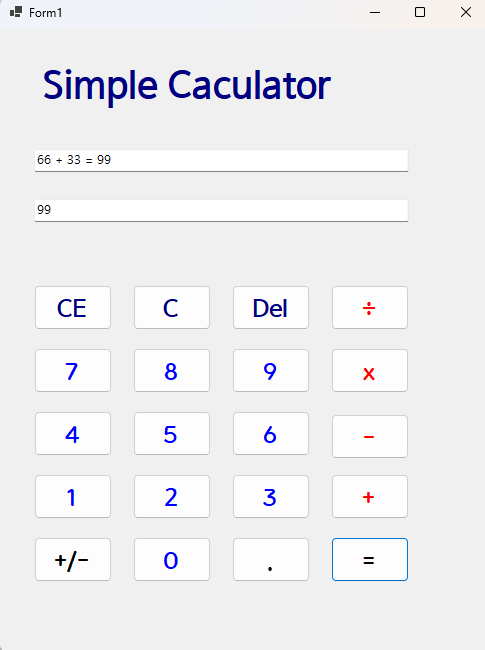
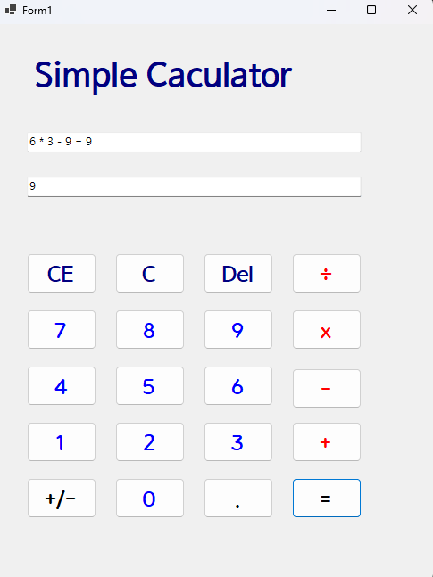
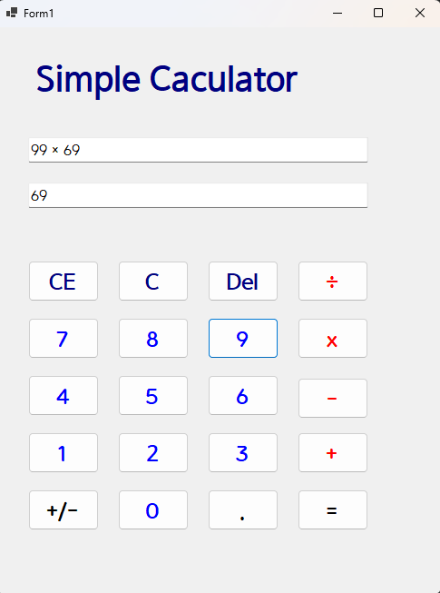
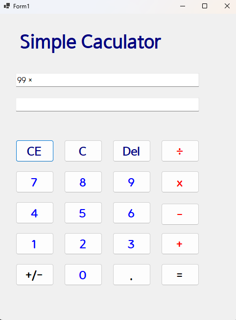
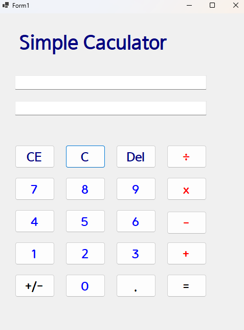

# (C# 코딩) 에코메신저

## 개요

-C# 프로그래밍학습

-1줄소개: 사용자키보드입력을받아서처리하는프로그램

-사용한플랫폼: 
 -C#, .NET Windows Forms, Visual Studio, GitHub

 

-사용한컨트롤:
 -Label, TextBox, ListBox, Button

 

-사용한기술과구현한기능:
 -Visual Studio를이용하여UI 디자인
 -string 클래스를이용한사용자입력데이터처리
 -함수를 만들어 코드를 간단히함
 -사칙연산(+, -, *, /) 함수를 만들어 버튼을 누를댸 어떤 버튼을 눌렀는지에 따라 계산이 되도록 구현
 -*,/ 곱하기 나누기의 경우 쉽게 인식 할 수 있도록 버튼 클릭시 *,/가 아닌 x,÷ 로 텍스트 박스에서 보이도록 함수를 만듬
 -CE, C, Del 버튼을 만들어 각각 숫자 한묶음 삭제, 전체 초기화, 숫자 한자리 삭제 기능 구현

## 실행화면(과제1)
 

-과제1코드의실행스크린샷
 

-과제내용
 -label(simplecaculator), 버튼 여러개, 텍스트 박스 2개를 적절히 배치한다.
 -버튼 클릭시 텍스트 박스에 2가지 방식으로 입력되어 나타난다.
 -사칙연산 기능 + 버튼 클릭시 +기능 작동 = 클릭시 결과 출력
 -2개의 피연산자 값을 int로 바꾸어 더하기 계산 수행

-구현내용과기능설명
 -라벨, 버튼, 텍스트 박스 위치를 적절히 배치함
 -숫자 버튼 클릭시 텍스트 박스 1,2 에 숫자가 입력된다.
 -텍스트 박스 1 에는 전체 식이 입력된다.
 -텍스트 박스 2 에는 마지막 숫자만 입력된다.
 -사칙연산중 + 버튼의 기능이 구현됨
 - = 버튼 클릭시 전체 식이 계산되어 결과가 = 뒤에 출력됨
 

## 실행화면(과제2)
 

-과제2코드의실행스크린샷

여러가지 연산자 복합계산 구현

-과제2코드의실행스크린샷
 

-과제내용
 -더하기, 뺴기, 곱하기, 나누기 구현 
 -여러가지 연산자를 입력하더라도 계산
 -연속계산

-구현내용과기능설명
 -+버튼을 울렸을떄 더하기 기능 구현 
 -- 버튼을 눌렀을떄 뺴기 기능 구현
 -x 버튼을 눌렀을떄 곱하기 버튼 구현
 -나누기 버튼 구현
 -여러가지 연산자를 입력하더라도 계산됨
 -사칙연산을 할 수 있는 함수를 하나 만들어버튼 마다 코드를 짜지 않고 간단하게 함수를 호출하여 계산이 되도록 구현
 -*,/ 버튼 클릭시 텍스트 박스에서 x,÷로 보이도록 함수를 만들어 구현

## 실행화면(과제3)
 

-과제3코드의실행스크린샷
 

del 버튼 사용

-과제3코드의실행스크린샷

CE 버튼 사용

-과제3코드의실행스크린샷

C 버튼 사용

-과제3코드의실행스크린샷

-과제내용
 -부가 버튼 기능 구현 
 -C, CE, Del 버튼 구현 
 -C 전체 초기화
 -CE 숫자 한묶음? 삭제
 -Del 숫자 한자리 삭제

-구현내용과기능설명
 -C 버튼 클릭시 매소드 clear를 이용하여 초기화 ex) 1 + 12 -> 초기화 아무것도 안뜸
 -CE 버튼 클릭시 매소드와 조건문 등을 이용하여 구현
 -CE 버튼 클릭시 숫자 한묶음 삭제 ex) 1 + 12 -> 1+ 
 -Del 버튼 클릭시 매소드와 조건문 등을 이용하여 구현
 -Del버튼 클릭시 숫자 한개 삭제 ex) 1+ 123 -> 1+ 12
 -Del버튼 클릭시 기호도 삭제 됨 ex) 100 + 12 + -> 100 + 12
 

